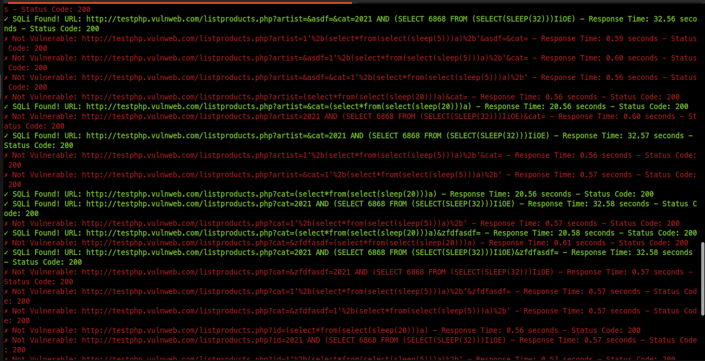

## Installation

```
cd /opt/ && sudo git clone https://github.com/freelancermijan/bsqli.git && cd bsqli/

sudo chmod +x ./*.py

cd

sudo apt install dos2unix -y

sudo dos2unix /opt/bsqli/bsqli.py

sudo ln -sf /opt/bsqli/bsqli.py /usr/local/bin/bsqli

bsqli -h
```
## Features

1. Multi Parameter scanning.
2. Others


